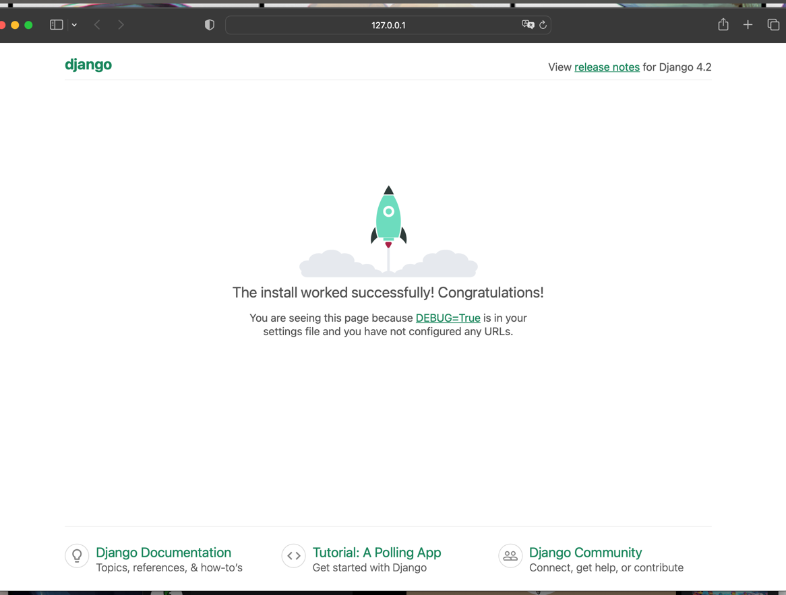

# 概要
サポーターズvol10ハッカソンのとーむ「Pyてょn」のリポジトリ。

## 構築手順
#### ①こちらのリポジトリをクローンする。

<small>※クローンとは　ネット上のリポジトリの内容を自身のローカルPC内にコピーして持ってくること</small>

#### ②ローカルにもってこれたらrequirements.txt内のライブラリをインストールする

```
pip install -r requirements.txt
```

#### ③データベースのマイグレート
```
#マイグレーションファイルを作成。modelsに変更がなければNo changes detectedとなるかも

python manage.py makemigrations
```

```
#マイグレーションファイルをデータベースに適用

python manage.py migrate
```

#### ④.envを作成
DjangoやAPIを使うとき、key(秘密の鍵)と言うものが必要になったりします。

これは秘密のものなので、公のリポジトリにはあげてはいけません。

そのため、チーム内で共有し「.env」というファイルを作成しその中にkeyを入れましょう。

ルートディレクトリに.envというファイルを作成。
↓
チームから共有されたkeyをその中に貼り付け。

#### ⑤以下のコマンドでサーバーを動かす
```
python manage.py runserver
```
以下の画面になればひとまず大丈夫
